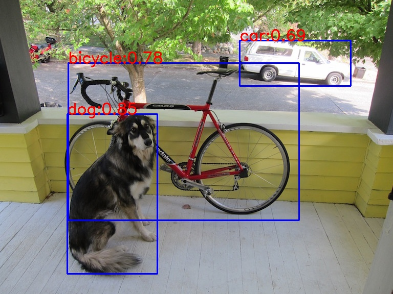

# YOLOv5 Deployment with C++
Real time object detection with deployment of YOLOv5 through LibTorch C++ API

### Prerequisites

- Ubuntu 18.04
- PyTorch 
- OpenCV 3.2.0
- LibTorch 1.6.0
- CMake 3.10.2
- Python>=3.6.0
- Pytorch>=1.7.0 

### Installation

1. Install OpenCV.

   ```shell
   sudo apt-get install libopencv-dev
   ```

2. Install LibTorch.

   ```shell
   wget https://download.pytorch.org/libtorch/nightly/cpu/libtorch-shared-with-deps-latest.zip
   unzip libtorch-shared-with-deps-latest.zip
   ```

3. Edit "CMakeLists.txt" to configure OpenCV and LibTorch correctly.

### Model Preparation
To develop Pytorch YOLOV5 model in C++ environment, we need to transfer the model format. In this work, we use 'TorchScript'. Normally, we should follow the steps:

   ```shell
   import torch
   model = torch.load('yolov5s.pth')
   model.eval()
   # Method 1: use script
   scripted_module = torch.jit.script(model)
   torch.jit.save(scripted_module, "yolov5s_torchscript.pt")
   # Method 2: use trace
   example = torch.ones() 
   traced_module = torch.jit.trace(model, example)
   torch.jit.save(traced_module, "yolov5s_torchscript.pt")
   ```
Fortunately, the official repository has offered the code, please refer to the official document [here](#https://github.com/ultralytics/yolov5).

We need to modify following code from the original export.py in official document.

   ```shell
   # line 29
   model.model[-1].export = False
   ```

Run the following commands to export model:

   ```shell
   git clone https://github.com/ultralytics/yolov5
   cd yolov5
   export PYTHONPATH="$PWD"  # add path
   python models/export.py --weights yolov5s.pt --img 640 --batch 1  # export
   ```

### Setup

   ```shell
   git clone 
   cd /path/to/YOLOV5Detection_LibTorch
   mkdir build
   cd build
   cmake ..
   make
   ./../bin/YOLOv5Detection_LibTorch
   ```

### Demo

<div align="center">
  
</div>
